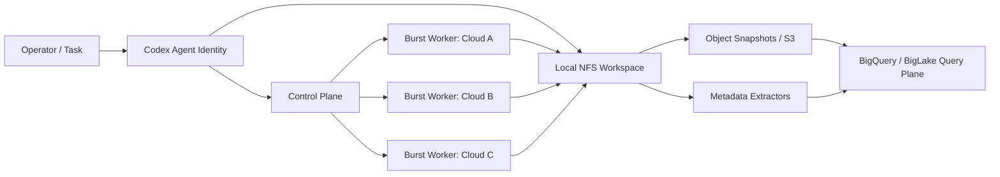

# New Horizons

New Horizons is a theory repo for a single Codex agent that can burst beyond one machine by flex-allocating execution across multiple cloud providers while treating a local NFS share as the durable system of record.

The core claim is simple: one agent should keep one identity, one task graph, and one provenance trail even when its heavy work is offloaded to a changing pool of compute from different vendors.

## Why This Repo Exists

- Explore burst execution for one agent without turning the system into an opaque swarm.
- Keep operator control over cost, data locality, and failure boundaries.
- Use the shared NFS root as the canonical workspace, then project searchable metadata into object storage and analytics systems.
- Treat S3 and BigQuery as indexing and query planes, not the only source of truth.

## System Sketch



## Components

| Layer | Role | Notes |
| --- | --- | --- |
| `🧠 Agent identity` | Preserves conversation state and execution intent. | One logical agent, many temporary workers. |
| `🎛️ Control plane` | Chooses when to burst, where to run, and what budget to spend. | Needs provider scoring, quotas, and lease handling. |
| `⚙️ Burst workers` | Execute bounded sub-tasks on elastic compute. | Ideally stateless and disposable. |
| `🗂️ NFS workspace` | Holds the canonical repo tree, logs, artifacts, and checkpoints. | Local-first and recoverable without cloud state. |
| `🪣 Object snapshots` | Stores mirrored manifests, chunks, or event batches in S3. | Useful for decoupled analytics ingestion. |
| `🔎 Query plane` | Exposes inventory, lineage, and search through BigQuery. | Good for large metadata joins and audit views. |

## Design Thesis

1. The agent should decide to burst only when local execution is slower, costlier, or less reliable than an external worker.
2. Burst workers should receive narrow leases: task spec, time budget, capability budget, and storage scope.
3. The local NFS share should remain the authoritative workspace because it is inspectable, repairable, and provider-neutral.
4. Large-scale search should come from extracted metadata, embeddings, and manifests rather than direct scans of the NFS tree during every query.
5. Cross-cloud analytics should be tolerant of delay; execution needs freshness, but reporting can run on a lagged index.

## Practical Interpretation

The interesting path is not "move the whole agent into the cloud." The interesting path is:

- keep the agent anchored locally;
- lease expensive work to remote runners;
- sync back results, logs, and artifact manifests;
- publish query-friendly indexes to S3;
- expose those indexes to BigQuery for fleet-wide search, lineage, and cost analysis.

That split keeps the human-visible workspace local while still letting the system rent compute from whichever provider is cheapest or fastest at a given moment.

## Open Questions

- How should the control plane compare GPU-rich but expensive providers against slower CPU-only providers?
- Which artifacts belong directly on NFS, and which should be materialized immediately into object storage?
- When BigQuery is reading metadata derived from S3, what lag is acceptable before operator trust starts to degrade?
- How much of the scheduler can remain heuristic before it needs a market-style bidding model?
- What is the minimum provenance envelope needed so offloaded work remains auditable?

## Next Reading

- [Architecture Notes](docs/architecture.md)

## Notebooks

The repo now includes a notebook suite under `notebooks/`:

- `01_burst_scheduler_playground.ipynb`: heuristic provider scoring and burst decisions.
- `02_nfs_manifest_index.ipynb`: local-repo manifest extraction plus S3 and BigQuery index shaping.
- `03_budget_latency_simulation.ipynb`: simulation of local-only versus burst-aware execution policy.

To run them locally:

```bash
python -m pip install -r requirements.txt
jupyter lab
```

For headless verification without Jupyter:

```bash
make train-notebooks
```

## GitHub Actions

The repo includes a training workflow in `.github/workflows/training-runs.yml`.

It does two things on `main` pushes and manual dispatch:

- executes the notebooks through a standard-library runner;
- runs cloud-auth smoke tests against whichever provider secrets are present in the `training` GitHub environment.

## Environment Credential Sync

This repo also includes a repo-local credential sync workflow:

```bash
export GH_ENVIRONMENT=training
make github-env-credentials
```

What it attempts to collect from the current machine:

- AWS env vars plus `~/.aws/credentials` and `~/.aws/config`
- GCP project config and ADC JSON when available
- Azure env vars plus active Azure CLI account metadata and a current ARM access token

The generated `.env` is ignored by git and is overwritten on each run.
